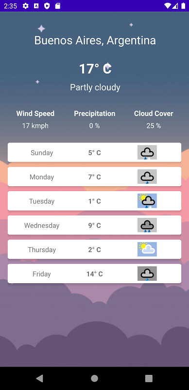

# Weather App

> A simple Android weather app using MVI architecture. Please refer to app_test.apk file for quick testing

## Table of contents

- [General info](#general-info)
- [Screenshots](#screenshots)
- [Technologies](#technologies)
- [Project Structure](#project-structure)

## General info

- This app allows user to search for the weather of any city in the world and see a history of made searches

- Data is provided by Weatherstack free plan API : https://weatherstack.com/

- The architecture used is MVVI (Model-View-Intent)

## Screenshots

## Technologies
- Androidx
- Kotlin
- Android Architecture Components

## Project Structure

+ application ``//main Application class``
+ data ``//data model and POJO``
+ di ``//dependency injection related classes``
+ repository ``//data repository single true source of data``
+ ui ``//activities and fragments``
+ util ``//helper classes``
